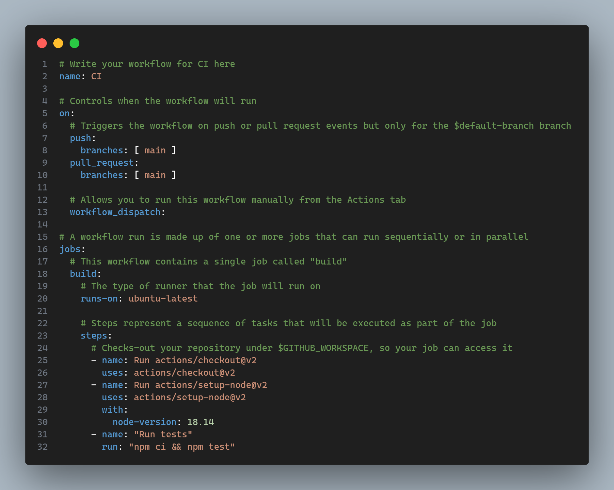
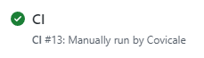

# Practica Espree-Logging

# Documentacion código generada con JSdoc

Para generar esta documentación, se ha utilizado la libreria **jsdoc-to-markdown**. Para generarla, es tan simple como hacer:

```sh 
$ jsdoc2md src/logging-espree.js > README.md
``` 

## Functions

<dl>
<dt><a href="#transpile">transpile(inputFile, outputFile)</a> ⇒ <code>void</code></dt>
<dd><ul>
<li>Transforms the code of a file, adding a console.log when we
 enter a function, writing it into a file if the outputFile
 parameter is specified, otherwise writing in the console.</li>
</ul>
</dd>
<dt><a href="#addLogging">addLogging(code)</a> ⇒ <code>String</code></dt>
<dd><ul>
<li>Transforms the code of a file, adding a console.log when we
enter a function of types FunctionDeclaration, FunctionExpression or
 ArrowFunctionExpression.</li>
</ul>
</dd>
<dt><a href="#addBeforeCode">addBeforeCode(node)</a> ⇒ <code>void</code></dt>
<dd><ul>
<li>Adds a console.log if we enter into a function,
 arrow function or anonymous function, specifying the name of the function,
 the parameters and the line number.</li>
</ul>
</dd>
</dl>

<a name="transpile"></a>

## transpile(inputFile, outputFile) ⇒ <code>void</code>
- Transforms the code of a file, adding a console.log when we
   enter a function, writing it into a file if the outputFile
   parameter is specified, otherwise writing in the console.

**Kind**: global function  
**Returns**: <code>void</code> - - Nothing  

| Param | Type | Description |
| --- | --- | --- |
| inputFile | <code>String</code> | The path of the file to be transformed |
| outputFile | <code>String</code> | The path of the file where the transformed code will be saved |

<a name="addLogging"></a>

## addLogging(code) ⇒ <code>String</code>
- Transforms the code of a file, adding a console.log when we
  enter a function of types FunctionDeclaration, FunctionExpression or
 ArrowFunctionExpression.

**Kind**: global function  
**Returns**: <code>String</code> - - The transformed code  

| Param | Type | Description |
| --- | --- | --- |
| code | <code>String</code> | The code to be transformed |

<a name="addBeforeCode"></a>

## addBeforeCode(node) ⇒ <code>void</code>
- Adds a console.log if we enter into a function,
   arrow function or anonymous function, specifying the name of the function,
   the parameters and the line number.

**Kind**: global function  
**Returns**: <code>void</code> - - Nothing  

| Param | Type | Description |
| --- | --- | --- |
| node | <code>Node</code> | The node were we are currently |

# Instalación

Para instalarlo es tan sencillo como escribir: 


## Ejemplo de uso

Una vez instalado, un ejemplo de uso es el siguiente:


Donde obtenemos la función *addLogging* de la carpeta @alu0101397627/espree-logging, ubicada en la carpeta de los modules de node. Al estar declarado en el packaje.json del modulo un atributo *main* que indica donde esta el archivo a exportar, no hace falta escribir la ruta completa.

El output de este mini programa, para comprobar que funciona, es el siguiente:


Funcionando como es debido.

# Ejecutable

El ejecutable funciona correctamente y se puede ejecutar desde el propio modulo como es debido, al haber declarado el fichero en el package.json, en el atributo *bin*

Aqui podemos ver como podemos ejecutarlo, funcionando todos los argumentos:


Podra tener 1 argumento y 1 opciones **(además del -h y -V)**:
- **filename**: El fichero con el codigo a evaluar
- **-o --output <filename>**: Fichero donde se quiera guardar el codigo generado (opcional)

## Código


Este código, se encarga de leer el fichero de entrada, añadirle el logging con la función descrita y explicada más abajo y escribirlo en el fichero de salida, si se ha especificado. En caso de no especificarse, se escribe por consola.

# Como funciona

El archivo principal que se encarga de añadir el logging a las funciones, en que linea se encuentran y cuando se entra, es el **/src/logging-espree.js**, más en concreto estas 2 parte:


Esta primera función, se encarga de parsear el código, recorrerlo y añadir el logging a las funciones que se encuentren. Para ello, se utiliza la libreria **espree** para parsear el código, y **estraverse** para recorrer el árbol generado por el parseo. En el momento que al entrar a un nodo, encuentre una función de los siguientes tipos:
* **FunctionDeclaration**
* **FunctionExpression**
* **ArrowFunctionExpression**

Llama a la función **addBeforeCode** que se encarga de añadir el logging a la función.


Esta función, se encarga de añadir el logging a la función, para ello, se encarga de generar el código que se quiere añadir, en este caso, un console.log con el nombre de la función, los parametros que recibe y en que linea se encuentra.

Gracias al atributo **loc** de la función, podemos obtener la linea en la que se encuentra, y gracias a **id** y **params** podemos obtener el nombre de la función y los parametros que recibe.

# Tests

Para los tests, se ha utilizado la libreria **jest**. Para ejecutarlo, es tan simple como hacer *npm test* y en el caso de que se quiera hacer cubrimiento, es tan simple como hacer *npm run cov*.

El código de los tests es el siguiente:


Este código, se encarga de recorrer el array de tests, y para cada uno de ellos, se encarga de hacer la transpilación, comprobar que el código generado es el correcto y que la evaluación del código generado es la correcta.

Tanto los tests, como las soluciones de estos, están guardados en un fichero llamado **test-description.mjs**.


Donde cada uno de los tests, tiene los siguientes atributos:
- **input**: El fichero de entrada
- **output**: El fichero de salida
- **correctLogged**: El fichero con el código correcto
- **correctOut**: El fichero con el output correcto

# Scripts

En el package.json, se han declarado los siguientes scripts:


- **exec**: Ejecuta el ejecutable
- **exec-test**: Ejecuta el ejecutable con el fichero de test1
- **test**: Ejecuta los tests
- **cov**: Ejecuta los tests con el cubrimiento
- **clean**: Limpia los ficheros generados por los tests

# Github Actions
Por último, implementamos la integración continua (CI) con Github Actions, donde creamos dentro del directorio ```/.github/worfklows``` un fichero ```nodejs.yml``` donde configuraremos las acciones que queramos hacer, quedando el fichero algo asi:



Donde: 
1. Especificamos el nombre de la action *"CI"*
2. Configuramos que cada vez que haya un push en la rama main, se ejecute la action
3. Creamos las tareas de la action:
    
    * Especificamos el sistema operativo a usar para las pruebas, en este caso ubuntu
    * Usamos actions/checkout para que el runner se descarge el repositorio
    * Usamos actions/setup-node para que el runner utilice node con la version que queremos
    * Ejecutamos npm ci *(igual al npm install pero se utiliza en entornos de integracion continua)* y npm test para ejecutar los tests.

Y si todo sale bien, nos saldrá un tick verde como el siguiente:



# NPM

El modulo se encuentra publicado en npm, y se puede encontrar en el siguiente enlace: https://www.npmjs.com/package/@alu0101397627/espree-logging

Para publicarlo, se ha tenido primero crear un usuario en npm y conectarnos con el comando *npm login*. Si todo ha salido correctamente, si hacemos *npm whoami* nos saldrá el nombre de usuario que hemos creado.

```sh 
$ npm whoami
alu0101397627
```

Una vez hecho esto, para publicar el modulo, simplemente tenemos que hacer *npm publish --access=public* y ya estará publicado, pero antes, deberemos asignarle el ambito, en nuestro caso *alu0101397627*. Para ello, en el package.json, en el nombre del paquete lo escribimos de la siguiente manera:

```json
"name": "@alu0101397627/espree-logging"
```

Y ya estaría publicado y accesible para todo el mundo, al ser un modulo publico.

# Cubrimiento

Para el cubrimiento, se ha utilizado la libreria **jest** con el argumento **--coverage**. Para ejecutarlo, es tan simple como hacer *npm run cov*.

El enlace a la página de cubrimiento es el siguiente:

 https://ull-esit-pl-2223.github.io/espree-logging-alexander-gonzalez-covic-alu0101397627/
